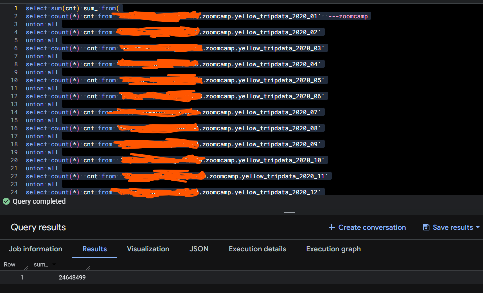
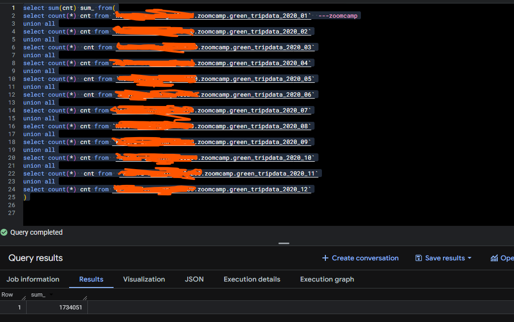
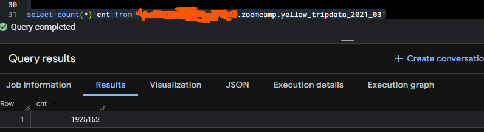

# NYC Taxi Data Pipeline with Kestra, Docker, and Google Cloud

This project implements a complete end-to-end ELT pipeline using Kestra as the orchestrator, Docker Compose for local infrastructure to spring up kestra , and Google Cloud Platform (bucket and BigQuery) as the storage and data lake. The pipeline ingests monthly NYC Yellow and Green Taxi trip data from 2019 - 2021, thhe csv dataset are stored in Google Cloud Storage, and loaded to the big query sing merge to avoid duplicates.

The design follows production-grade data engineering practices including idempotent loads, conditional branching, external tables, merge-based deduplication, centralized configuration, and workflow-driven infrastructure setup.

---

## Architecture Overview

NYC TLC CSV.gz files (GitHub Releases)  
→ Kestra Scheduled Workflow  
→ Google Cloud Storage (raw CSV)  
→ BigQuery External Tables  
→ BigQuery Partitioned Tables  
→ MERGE for deduplication  

-------

## Technologies Used

- Kestra (workflow orchestration)
- Docker & Docker Compose
- Google Cloud Storage
- BigQuery
- PostgreSQL (Kestra metadata & queue)
- Shell scripting
- SQL
- NYC TLC public dataset

---

## Google Cloud Configuration with Kestra KV

Kestra Open Source does not include a secrets manager. Instead, this project uses Kestra’s Key-Value (KV) store to manage Google Cloud configuration and authentication.

The full Google Cloud service account JSON key is stored as a STRING KV and injected into all GCP plugins automatically.

KV keys used:
- GCP_PROJECT_ID
- GCP_LOCATION
- GCP_BUCKET_NAME
- GCP_DATASET
- GCP_CRED (full service account JSON)

---

## GCP Setup Flow (KV Initialization)

```yaml
id: 01_gcp_setup
namespace: zoomcamp_learning

tasks:
  - id: gcp_project_id
    type: io.kestra.plugin.core.kv.Set
    key: GCP_PROJECT_ID
    kvType: STRING
    value: kestra-learning-486200  

  - id: gcp_location
    type: io.kestra.plugin.core.kv.Set
    key: GCP_LOCATION
    kvType: STRING
    value: europe-west2

  - id: gcp_bucket_name
    type: io.kestra.plugin.core.kv.Set
    key: GCP_BUCKET_NAME
    kvType: STRING
    value: zc-kestra-learning-486200-kestra  

  - id: gcp_dataset
    type: io.kestra.plugin.core.kv.Set
    key: GCP_DATASET
    kvType: STRING
    value: zoomcamp
```

---

## Scheduling  

```yaml

id: 04_gcp_taxi_scheduled
namespace: zoomcamp_learning
description: |
  Best to add a label `backfill:true` from the UI to track executions created via a backfill.
  CSV data used here comes from: https://github.com/DataTalksClub/nyc-tlc-data/releases

inputs:
  - id: taxi
    type: SELECT
    displayName: Select taxi type
    values: [yellow, green]
    defaults: green

variables:
  file: "{{inputs.taxi}}_tripdata_{{trigger.date | date('yyyy-MM')}}.csv"
  gcs_file: "gs://{{kv('GCP_BUCKET_NAME')}}/{{vars.file}}"
  table: "{{kv('GCP_DATASET')}}.{{inputs.taxi}}_tripdata_{{trigger.date | date('yyyy_MM')}}"
  data: "{{outputs.extract.outputFiles[inputs.taxi ~ '_tripdata_' ~ (trigger.date | date('yyyy-MM')) ~ '.csv']}}"

tasks:
  - id: set_label
    type: io.kestra.plugin.core.execution.Labels
    labels:
      file: "{{render(vars.file)}}"
      taxi: "{{inputs.taxi}}"

  - id: extract
    type: io.kestra.plugin.scripts.shell.Commands
    outputFiles:
      - "*.csv"
    taskRunner:
      type: io.kestra.plugin.core.runner.Process
    commands:
      - wget -qO- https://github.com/DataTalksClub/nyc-tlc-data/releases/download/{{inputs.taxi}}/{{render(vars.file)}}.gz | gunzip > {{render(vars.file)}}

  - id: upload_to_gcs
    type: io.kestra.plugin.gcp.gcs.Upload
    from: "{{render(vars.data)}}"
    to: "{{render(vars.gcs_file)}}"

  - id: if_yellow_taxi
    type: io.kestra.plugin.core.flow.If
    condition: "{{inputs.taxi == 'yellow'}}"
    then:
      - id: bq_yellow_tripdata
        type: io.kestra.plugin.gcp.bigquery.Query
        sql: |
          CREATE TABLE IF NOT EXISTS `{{kv('GCP_PROJECT_ID')}}.{{kv('GCP_DATASET')}}.yellow_tripdata`
          (
              unique_row_id BYTES OPTIONS (description = 'A unique identifier for the trip, generated by hashing key trip attributes.'),
              filename STRING OPTIONS (description = 'The source filename from which the trip data was loaded.'),      
              VendorID STRING OPTIONS (description = 'A code indicating the LPEP provider that provided the record. 1= Creative Mobile Technologies, LLC; 2= VeriFone Inc.'),
              tpep_pickup_datetime TIMESTAMP OPTIONS (description = 'The date and time when the meter was engaged'),
              tpep_dropoff_datetime TIMESTAMP OPTIONS (description = 'The date and time when the meter was disengaged'),
              passenger_count INTEGER OPTIONS (description = 'The number of passengers in the vehicle. This is a driver-entered value.'),
              trip_distance NUMERIC OPTIONS (description = 'The elapsed trip distance in miles reported by the taximeter.'),
              RatecodeID STRING OPTIONS (description = 'The final rate code in effect at the end of the trip. 1= Standard rate 2=JFK 3=Newark 4=Nassau or Westchester 5=Negotiated fare 6=Group ride'),
              store_and_fwd_flag STRING OPTIONS (description = 'This flag indicates whether the trip record was held in vehicle memory before sending to the vendor, aka "store and forward," because the vehicle did not have a connection to the server. TRUE = store and forward trip, FALSE = not a store and forward trip'),
              PULocationID STRING OPTIONS (description = 'TLC Taxi Zone in which the taximeter was engaged'),
              DOLocationID STRING OPTIONS (description = 'TLC Taxi Zone in which the taximeter was disengaged'),
              payment_type INTEGER OPTIONS (description = 'A numeric code signifying how the passenger paid for the trip. 1= Credit card 2= Cash 3= No charge 4= Dispute 5= Unknown 6= Voided trip'),
              fare_amount NUMERIC OPTIONS (description = 'The time-and-distance fare calculated by the meter'),
              extra NUMERIC OPTIONS (description = 'Miscellaneous extras and surcharges. Currently, this only includes the $0.50 and $1 rush hour and overnight charges'),
              mta_tax NUMERIC OPTIONS (description = '$0.50 MTA tax that is automatically triggered based on the metered rate in use'),
              tip_amount NUMERIC OPTIONS (description = 'Tip amount. This field is automatically populated for credit card tips. Cash tips are not included.'),
              tolls_amount NUMERIC OPTIONS (description = 'Total amount of all tolls paid in trip.'),
              improvement_surcharge NUMERIC OPTIONS (description = '$0.30 improvement surcharge assessed on hailed trips at the flag drop. The improvement surcharge began being levied in 2015.'),
              total_amount NUMERIC OPTIONS (description = 'The total amount charged to passengers. Does not include cash tips.'),
              congestion_surcharge NUMERIC OPTIONS (description = 'Congestion surcharge applied to trips in congested zones')
          )
          PARTITION BY DATE(tpep_pickup_datetime);

      - id: bq_yellow_table_ext
        type: io.kestra.plugin.gcp.bigquery.Query
        sql: |
          CREATE OR REPLACE EXTERNAL TABLE `{{kv('GCP_PROJECT_ID')}}.{{render(vars.table)}}_ext`
          (
              VendorID STRING OPTIONS (description = 'A code indicating the LPEP provider that provided the record. 1= Creative Mobile Technologies, LLC; 2= VeriFone Inc.'),
              tpep_pickup_datetime TIMESTAMP OPTIONS (description = 'The date and time when the meter was engaged'),
              tpep_dropoff_datetime TIMESTAMP OPTIONS (description = 'The date and time when the meter was disengaged'),
              passenger_count INTEGER OPTIONS (description = 'The number of passengers in the vehicle. This is a driver-entered value.'),
              trip_distance NUMERIC OPTIONS (description = 'The elapsed trip distance in miles reported by the taximeter.'),
              RatecodeID STRING OPTIONS (description = 'The final rate code in effect at the end of the trip. 1= Standard rate 2=JFK 3=Newark 4=Nassau or Westchester 5=Negotiated fare 6=Group ride'),
              store_and_fwd_flag STRING OPTIONS (description = 'This flag indicates whether the trip record was held in vehicle memory before sending to the vendor, aka "store and forward," because the vehicle did not have a connection to the server. TRUE = store and forward trip, FALSE = not a store and forward trip'),
              PULocationID STRING OPTIONS (description = 'TLC Taxi Zone in which the taximeter was engaged'),
              DOLocationID STRING OPTIONS (description = 'TLC Taxi Zone in which the taximeter was disengaged'),
              payment_type INTEGER OPTIONS (description = 'A numeric code signifying how the passenger paid for the trip. 1= Credit card 2= Cash 3= No charge 4= Dispute 5= Unknown 6= Voided trip'),
              fare_amount NUMERIC OPTIONS (description = 'The time-and-distance fare calculated by the meter'),
              extra NUMERIC OPTIONS (description = 'Miscellaneous extras and surcharges. Currently, this only includes the $0.50 and $1 rush hour and overnight charges'),
              mta_tax NUMERIC OPTIONS (description = '$0.50 MTA tax that is automatically triggered based on the metered rate in use'),
              tip_amount NUMERIC OPTIONS (description = 'Tip amount. This field is automatically populated for credit card tips. Cash tips are not included.'),
              tolls_amount NUMERIC OPTIONS (description = 'Total amount of all tolls paid in trip.'),
              improvement_surcharge NUMERIC OPTIONS (description = '$0.30 improvement surcharge assessed on hailed trips at the flag drop. The improvement surcharge began being levied in 2015.'),
              total_amount NUMERIC OPTIONS (description = 'The total amount charged to passengers. Does not include cash tips.'),
              congestion_surcharge NUMERIC OPTIONS (description = 'Congestion surcharge applied to trips in congested zones')
          )
          OPTIONS (
              format = 'CSV',
              uris = ['{{render(vars.gcs_file)}}'],
              skip_leading_rows = 1,
              ignore_unknown_values = TRUE
          );

      - id: bq_yellow_table_tmp
        type: io.kestra.plugin.gcp.bigquery.Query
        sql: |
          CREATE OR REPLACE TABLE `{{kv('GCP_PROJECT_ID')}}.{{render(vars.table)}}`
          AS
          SELECT
            MD5(CONCAT(
              COALESCE(CAST(VendorID AS STRING), ""),
              COALESCE(CAST(tpep_pickup_datetime AS STRING), ""),
              COALESCE(CAST(tpep_dropoff_datetime AS STRING), ""),
              COALESCE(CAST(PULocationID AS STRING), ""),
              COALESCE(CAST(DOLocationID AS STRING), "")
            )) AS unique_row_id,
            "{{render(vars.file)}}" AS filename,
            *
          FROM `{{kv('GCP_PROJECT_ID')}}.{{render(vars.table)}}_ext`;

      - id: bq_yellow_merge
        type: io.kestra.plugin.gcp.bigquery.Query
        sql: |
          MERGE INTO `{{kv('GCP_PROJECT_ID')}}.{{kv('GCP_DATASET')}}.yellow_tripdata` T
          USING `{{kv('GCP_PROJECT_ID')}}.{{render(vars.table)}}` S
          ON T.unique_row_id = S.unique_row_id
          WHEN NOT MATCHED THEN
            INSERT (unique_row_id, filename, VendorID, tpep_pickup_datetime, tpep_dropoff_datetime, passenger_count, trip_distance, RatecodeID, store_and_fwd_flag, PULocationID, DOLocationID, payment_type, fare_amount, extra, mta_tax, tip_amount, tolls_amount, improvement_surcharge, total_amount, congestion_surcharge)
            VALUES (S.unique_row_id, S.filename, S.VendorID, S.tpep_pickup_datetime, S.tpep_dropoff_datetime, S.passenger_count, S.trip_distance, S.RatecodeID, S.store_and_fwd_flag, S.PULocationID, S.DOLocationID, S.payment_type, S.fare_amount, S.extra, S.mta_tax, S.tip_amount, S.tolls_amount, S.improvement_surcharge, S.total_amount, S.congestion_surcharge);

  - id: if_green_taxi
    type: io.kestra.plugin.core.flow.If
    condition: "{{inputs.taxi == 'green'}}"
    then:
      - id: bq_green_tripdata
        type: io.kestra.plugin.gcp.bigquery.Query
        sql: |
          CREATE TABLE IF NOT EXISTS `{{kv('GCP_PROJECT_ID')}}.{{kv('GCP_DATASET')}}.green_tripdata`
          (
              unique_row_id BYTES OPTIONS (description = 'A unique identifier for the trip, generated by hashing key trip attributes.'),
              filename STRING OPTIONS (description = 'The source filename from which the trip data was loaded.'),      
              VendorID STRING OPTIONS (description = 'A code indicating the LPEP provider that provided the record. 1= Creative Mobile Technologies, LLC; 2= VeriFone Inc.'),
              lpep_pickup_datetime TIMESTAMP OPTIONS (description = 'The date and time when the meter was engaged'),
              lpep_dropoff_datetime TIMESTAMP OPTIONS (description = 'The date and time when the meter was disengaged'),
              store_and_fwd_flag STRING OPTIONS (description = 'This flag indicates whether the trip record was held in vehicle memory before sending to the vendor, aka "store and forward," because the vehicle did not have a connection to the server. Y= store and forward trip N= not a store and forward trip'),
              RatecodeID STRING OPTIONS (description = 'The final rate code in effect at the end of the trip. 1= Standard rate 2=JFK 3=Newark 4=Nassau or Westchester 5=Negotiated fare 6=Group ride'),
              PULocationID STRING OPTIONS (description = 'TLC Taxi Zone in which the taximeter was engaged'),
              DOLocationID STRING OPTIONS (description = 'TLC Taxi Zone in which the taximeter was disengaged'),
              passenger_count INT64 OPTIONS (description = 'The number of passengers in the vehicle. This is a driver-entered value.'),
              trip_distance NUMERIC OPTIONS (description = 'The elapsed trip distance in miles reported by the taximeter.'),
              fare_amount NUMERIC OPTIONS (description = 'The time-and-distance fare calculated by the meter'),
              extra NUMERIC OPTIONS (description = 'Miscellaneous extras and surcharges. Currently, this only includes the $0.50 and $1 rush hour and overnight charges'),
              mta_tax NUMERIC OPTIONS (description = '$0.50 MTA tax that is automatically triggered based on the metered rate in use'),
              tip_amount NUMERIC OPTIONS (description = 'Tip amount. This field is automatically populated for credit card tips. Cash tips are not included.'),
              tolls_amount NUMERIC OPTIONS (description = 'Total amount of all tolls paid in trip.'),
              ehail_fee NUMERIC,
              improvement_surcharge NUMERIC OPTIONS (description = '$0.30 improvement surcharge assessed on hailed trips at the flag drop. The improvement surcharge began being levied in 2015.'),
              total_amount NUMERIC OPTIONS (description = 'The total amount charged to passengers. Does not include cash tips.'),
              payment_type INTEGER OPTIONS (description = 'A numeric code signifying how the passenger paid for the trip. 1= Credit card 2= Cash 3= No charge 4= Dispute 5= Unknown 6= Voided trip'),
              trip_type STRING OPTIONS (description = 'A code indicating whether the trip was a street-hail or a dispatch that is automatically assigned based on the metered rate in use but can be altered by the driver. 1= Street-hail 2= Dispatch'),
              congestion_surcharge NUMERIC OPTIONS (description = 'Congestion surcharge applied to trips in congested zones')
          )
          PARTITION BY DATE(lpep_pickup_datetime);

      - id: bq_green_table_ext
        type: io.kestra.plugin.gcp.bigquery.Query
        sql: |
          CREATE OR REPLACE EXTERNAL TABLE `{{kv('GCP_PROJECT_ID')}}.{{render(vars.table)}}_ext`
          (
              VendorID STRING OPTIONS (description = 'A code indicating the LPEP provider that provided the record. 1= Creative Mobile Technologies, LLC; 2= VeriFone Inc.'),
              lpep_pickup_datetime TIMESTAMP OPTIONS (description = 'The date and time when the meter was engaged'),
              lpep_dropoff_datetime TIMESTAMP OPTIONS (description = 'The date and time when the meter was disengaged'),
              store_and_fwd_flag STRING OPTIONS (description = 'This flag indicates whether the trip record was held in vehicle memory before sending to the vendor, aka "store and forward," because the vehicle did not have a connection to the server. Y= store and forward trip N= not a store and forward trip'),
              RatecodeID STRING OPTIONS (description = 'The final rate code in effect at the end of the trip. 1= Standard rate 2=JFK 3=Newark 4=Nassau or Westchester 5=Negotiated fare 6=Group ride'),
              PULocationID STRING OPTIONS (description = 'TLC Taxi Zone in which the taximeter was engaged'),
              DOLocationID STRING OPTIONS (description = 'TLC Taxi Zone in which the taximeter was disengaged'),
              passenger_count INT64 OPTIONS (description = 'The number of passengers in the vehicle. This is a driver-entered value.'),
              trip_distance NUMERIC OPTIONS (description = 'The elapsed trip distance in miles reported by the taximeter.'),
              fare_amount NUMERIC OPTIONS (description = 'The time-and-distance fare calculated by the meter'),
              extra NUMERIC OPTIONS (description = 'Miscellaneous extras and surcharges. Currently, this only includes the $0.50 and $1 rush hour and overnight charges'),
              mta_tax NUMERIC OPTIONS (description = '$0.50 MTA tax that is automatically triggered based on the metered rate in use'),
              tip_amount NUMERIC OPTIONS (description = 'Tip amount. This field is automatically populated for credit card tips. Cash tips are not included.'),
              tolls_amount NUMERIC OPTIONS (description = 'Total amount of all tolls paid in trip.'),
              ehail_fee NUMERIC,
              improvement_surcharge NUMERIC OPTIONS (description = '$0.30 improvement surcharge assessed on hailed trips at the flag drop. The improvement surcharge began being levied in 2015.'),
              total_amount NUMERIC OPTIONS (description = 'The total amount charged to passengers. Does not include cash tips.'),
              payment_type INTEGER OPTIONS (description = 'A numeric code signifying how the passenger paid for the trip. 1= Credit card 2= Cash 3= No charge 4= Dispute 5= Unknown 6= Voided trip'),
              trip_type STRING OPTIONS (description = 'A code indicating whether the trip was a street-hail or a dispatch that is automatically assigned based on the metered rate in use but can be altered by the driver. 1= Street-hail 2= Dispatch'),
              congestion_surcharge NUMERIC OPTIONS (description = 'Congestion surcharge applied to trips in congested zones')
          )
          OPTIONS (
              format = 'CSV',
              uris = ['{{render(vars.gcs_file)}}'],
              skip_leading_rows = 1,
              ignore_unknown_values = TRUE
          );

      - id: bq_green_table_tmp
        type: io.kestra.plugin.gcp.bigquery.Query
        sql: |
          CREATE OR REPLACE TABLE `{{kv('GCP_PROJECT_ID')}}.{{render(vars.table)}}`
          AS
          SELECT
            MD5(CONCAT(
              COALESCE(CAST(VendorID AS STRING), ""),
              COALESCE(CAST(lpep_pickup_datetime AS STRING), ""),
              COALESCE(CAST(lpep_dropoff_datetime AS STRING), ""),
              COALESCE(CAST(PULocationID AS STRING), ""),
              COALESCE(CAST(DOLocationID AS STRING), "")
            )) AS unique_row_id,
            "{{render(vars.file)}}" AS filename,
            *
          FROM `{{kv('GCP_PROJECT_ID')}}.{{render(vars.table)}}_ext`;

      - id: bq_green_merge
        type: io.kestra.plugin.gcp.bigquery.Query
        sql: |
          MERGE INTO `{{kv('GCP_PROJECT_ID')}}.{{kv('GCP_DATASET')}}.green_tripdata` T
          USING `{{kv('GCP_PROJECT_ID')}}.{{render(vars.table)}}` S
          ON T.unique_row_id = S.unique_row_id
          WHEN NOT MATCHED THEN
            INSERT (unique_row_id, filename, VendorID, lpep_pickup_datetime, lpep_dropoff_datetime, store_and_fwd_flag, RatecodeID, PULocationID, DOLocationID, passenger_count, trip_distance, fare_amount, extra, mta_tax, tip_amount, tolls_amount, ehail_fee, improvement_surcharge, total_amount, payment_type, trip_type, congestion_surcharge)
            VALUES (S.unique_row_id, S.filename, S.VendorID, S.lpep_pickup_datetime, S.lpep_dropoff_datetime, S.store_and_fwd_flag, S.RatecodeID, S.PULocationID, S.DOLocationID, S.passenger_count, S.trip_distance, S.fare_amount, S.extra, S.mta_tax, S.tip_amount, S.tolls_amount, S.ehail_fee, S.improvement_surcharge, S.total_amount, S.payment_type, S.trip_type, S.congestion_surcharge);

  - id: purge_files
    type: io.kestra.plugin.core.storage.PurgeCurrentExecutionFiles
    description: To avoid cluttering your storage, we will remove the downloaded files

pluginDefaults:
  - type: io.kestra.plugin.gcp
    values:
      serviceAccount: "{{kv('GCP_CRED')}}"
      projectId: "{{kv('GCP_PROJECT_ID')}}"
      location: "{{kv('GCP_LOCATION')}}"
      bucket: "{{kv('GCP_BUCKET_NAME')}}"

triggers:
  - id: green_schedule
    type: io.kestra.plugin.core.trigger.Schedule
    cron: "0 9 1 * *"
    inputs:
      taxi: green

  - id: yellow_schedule
    type: io.kestra.plugin.core.trigger.Schedule
    cron: "0 10 1 * *"
    inputs:
      taxi: yellow
```

---Analysis

Google bigquery is used o perform the analysis to answer the homework assessment.

1. How many rows are there for the Yellow Taxi data for all CSV files in the year 2020?



2. How many rows are there for the Green Taxi data for all CSV files in the year 2020?


3. How many rows are there for the Yellow Taxi data for the March 2021 CSV file?




## Conlcusion

This project exposed me to many new concepts. Beyond orchestration, scheduling and backfill execution, I learned that Kestra can also be used to provision cloud services in a way that is similar to Infrastructure as a Service (IaaS), much like Terraform. However, unlike Terraform, Kestra does not maintain state in the same way, nor does it automatically handle resource destruction. These capabilities may exist in some form, but further research is required to fully understand them.

Overall, using YAML to define everything made the workflow straightforward and easy to follow. Thanks to our instructors, making the structure and approach simplified annd also provideing YAML template for learning and doing the assignment.